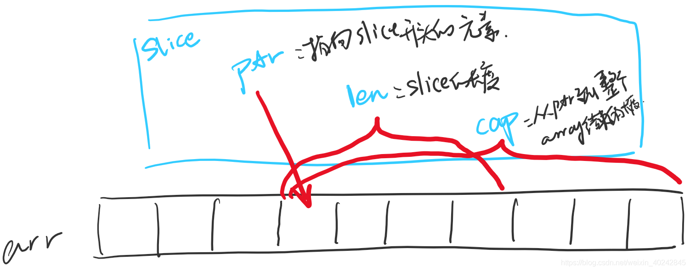
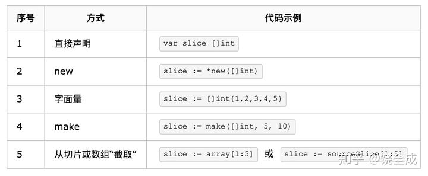
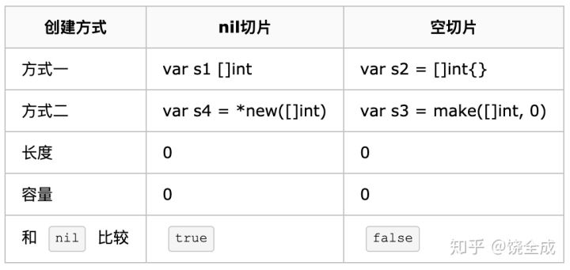

# 刨根问底


### 先来看一段代码

```go

	// 创建 listener
	listener, err := net.Listen("tcp", "127.0.0.1:8080")
	if err != nil {
		fmt.Println("Error listening", err.Error())
		return //终止程序
	}
	for { 	// 监听并接受来自客户端的连接
		conn, err := listener.Accept()
		if err != nil {
			fmt.Println("Error accepting", err.Error())
			return // 终止程序
		}
		go func(connect net.Conn) {
			defer connect.Close()
			for {
				buf := make([]byte, 2048)
				len, err := connect.Read(buf)
				if err != nil {
					return //终止程序
				}
				fmt.Println(buf[:len])
			}
		}(conn)
	}
	
	#output
	[71 69 84 32 47 112 97 116 104 47 116 111 63 105 100 61 49 48 48 32 72 84 84 80 47 49 46 49 13 10 72 111 115 116 58 32 49 50 55 46 48 46 48 46 49 58 56 48 56 48 13 10 67 111 110 110 101 99 116 105 111 110 58 32 107 101 101 112 45 97 108 105 118 101 13 10 67 97 99 104 101 45 67 111 110 116 114 111 108 58 32 109 97 120 45 97 103 101 61 48 13 10 115 101 99 45 99 104 45 117 97 58 32 34 32 78 111 116 32 65 59 66 114 97 110 100 34 59 118 61 34 57 57 34 44 32 34 67 104 114 111 109 105 117 109 34 59 118 61 34 57 56 34 44 32 34 71 111 111 103 108 101 32 67 104 114 111 109 101 34 59 118 61 34 57 56 34 13 10 115 101 99 45 99 104 45 117 97 45 109 111 98 105 108 101 58 32 63 48 13 10 115 101 99 45 99 104 45 117 97 45 112 108 97 116 102 111 114 109 58 32 34 87 105 110 100 111 119 115 34 13 10 85 112 103 114 97 100 101 45 73 110 115 101 99 117 114 101 45 82 101 113 117 101 115 116 115 58 32 49 13 10 85 115 101 114 45 65 103 101 110 116 58 32 77 111 122 105 108 108 97 47 53 46 48 32 40 87 105 110 100 111 119 115 32 78 84 32 54 46 49 59 32 87 105 110 54 52 59 32 120 54 52 41 32 65 112 112 108 101 87 101 98 75 105 116 47 53 51 55 46 51 54 32 40 75 72 84 77 76 44 32 108 105 107 101 32 71 101 99 107 111 41 32 67 104 114 111 109 101 47 57 56 46 48 46 52 55 53 56 46 49 48 50 32 83 97 102 97 114 105 47 53 51 55 46 51 54 13 10 65 99 99 101 112 116 58 32 116 101 120 116 47 104 116 109 108 44 97 112 112 108 105 99 97 116 105 111 110 47 120 104 116 109 108 43 120 109 108 44 97 112 112 108 105 99 97 116 105 111 110 47 120 109 108 59 113 61 48 46 57 44 105 109 97 103 101 47 97 118 105 102 44 105 109 97 103 101 47 119 101 98 112 44 105 109 97 103 101 47 97 112 110 103 44 42 47 42 59 113 61 48 46 56 44 97 112 112 108 105 99 97 116 105 111 110 47 115 105 103 110 101 100 45 101 120 99 104 97 110 103 101 59 118 61 98 51 59 113 61 48 46 57 13 10 83 101 99 45 70 101 116 99 104 45 83 105 116 101 58 32 110 111 110 101 13 10 83 101 99 45 70 101 116 99 104 45 77 111 100 101 58 32 110 97 118 105 103 97 116 101 13 10 83 101 99 45 70 101 116 99 104 45 85 115 101 114 58 32 63 49 13 10 83 101 99 45 70 101 116 99 104 45 68 101 115 116 58 32 100 111 99 117 109 101 110 116 13 10 65 99 99 101 112 116 45 69 110 99 111 100 105 110 103 58 32 103 122 105 112 44 32 100 101 102 108 97 116 101 44 32 98 114 13 10 65 99 99 101 112 116 45 76 97 110 103 117 97 103 101 58 32 122 104 45 67 78 44 122 104 59 113 61 48 46 57 44 122 104 45 84 87 59 113 61 48 46 56 13 10 67 111 111 107 105 101 58 32 72 109 95 108 118 116 95 97 100 53 97 56 54 56 98 51 99 54 54 48 56 101 51 53 56 48 102 50 102 55 101 52 100 55 54 100 54 54 100 61 49 54 51 49 48 56 56 48 49 52 44 49 54 51 49 49 53 48 51 52 48 44 49 54 51 49 50 52 55 48 52 55 13 10 13 10]
```


## BIT,BYTE,UTF8,UNICODE,RUNE

每个int 在64位机器上占用 8个字节  在32位机器上占用 4 个字节。

位:（bit）：是计算机 内部数据 储存的最小单位，11001100是一个八位二进制数。

字节:（byte）：是计算机中 数据处理 的基本单位，习惯上用大写  B  来表示,1B（byte,字节）= 8bit（位）。

Unicode:统一码（Unicode），也叫万国码、单一码，是计算机科学领域里的一项业界标准，包括字符集、编码方案等。Unicode是为了解决传统的字符编码方案的局限而产生的，它为每种语言中的每个字符设定了统一并且唯一的二进制编码，以满足跨语言、跨平台进行文本转换、处理的要求

rune数据: 说的通俗一点就是rune一个值代表的就是一个Unicode字符，因为一个Go语言中字符串编码为UTF-8，使用1-4字节就可以表示一个字符，所以使用int32类型范围就可以完美适配。
 

UTF8编码规则：

1）单字节规则： 对于 单字节 的符号，字节的第一位（最高位）设为 0，后面 7 位为这个符号的 unicode 码。

2）n字节规则： 对于 n 字节的符号（n>1），第一个字节的前 n 位都设为 1，第 n+1 位设为 0，后面字节的前两位一律设为 10。剩下的没有提及的二进制位，全部为这个符号的 unicode 码。
```
S
-- byte --> [83] --> 二进制后（01010011）
-- unicode --> 十六进制后 \u0053（1000111）
-- UTF-8 --> 0x53（0 1000111）

索
-- byte --> [231 180 162] --> 二进制后（11100111 10110100 10100010）
-- unicode --> 32034 -> 十六进制后 \u7d22（111110100100010）  -->0111110100100010(unicode) 
-- UTF-8 --> 111110100100010

```

### 结果返回
```

GET /path/to?id=100 HTTP/1.1
Host: 127.0.0.1:8080
Connection: keep-alive
Cache-Control: max-age=0
sec-ch-ua: " Not A;Brand";v="99", "Chromium";v="98", "Google Chrome";v="98"
sec-ch-ua-mobile: ?0
sec-ch-ua-platform: "Windows"
Upgrade-Insecure-Requests: 1
User-Agent: Mozilla/5.0 (Windows NT 6.1; Win64; x64) AppleWebKit/537.36 (KHTML, like Gecko) Chrome/98.0.4758.102 Safari/537.36
Accept: text/html,application/xhtml+xml,application/xml;q=0.9,image/avif,image/webp,image/apng,*/*;q=0.8,application/signed-exchange;v=b3;q=0.9
Sec-Fetch-Site: none
Sec-Fetch-Mode: navigate
Sec-Fetch-User: ?1
Sec-Fetch-Dest: document
Accept-Encoding: gzip, deflate, br
Accept-Language: zh-CN,zh;q=0.9,zh-TW;q=0.8
Cookie: Hm_lvt_ad5a868b3c6608e3580f2f7e4d76d66d=1631088014,1631150340,1631247047
```


## ARRAY & SLICE 切片

### ARRAY
概念:存储一组相同数据类型的数据结构。

特点:有序(下标index)，数据可以重复,定长,索引能力强。

语法：

      A：数组的创建
         var variable_name [SIZE] variable_type
         var a [4] int
         var b = [4]int{}
         var c = [4] int {1,2,3,4}
         var d = [4]int{1,2}
         e := [4]int{index:value}
         f:=[...] int{}
      B：数组的访问
         主要通过下标：index，取值范围是：从0开始，到长度减1。
         index：[0,len(arr)-1]
            0,1,2,3,4,5.....
         赋值：
         数组名[index] = value
         取值：
         数组名[index]

      常用的内置函数：
      len(),长度-->容器中存储的元素的个数
      cap(),容量-->容器中存储的最多元素的个数

   注意事项：
      1.一个数组中只能存储同一种类型的数据。


#### SLICE 切片

https://blog.csdn.net/weixin_40242845/article/details/101317771

https://zhuanlan.zhihu.com/p/61121325

了解 slice 的本质，最简单的方法就是看它的源代码：

```
    // runtime/slice.go
   type slice struct {
       array unsafe.Pointer // 元素指针
       len   int // 长度 
       cap   int // 容量
   }
 ```
 
三个属性： 

指针，指向底层数组； 

长度，表示切片可用元素的个数，也就是说使用下标对 slice 的元素进行访问时，下标不能超过 slice 的长度；
 
容量，底层数组的元素个数，容量 >= 长度。



注意 底层数组是可以被多个 slice 同时指向的，因此对一个 slice 的元素进行操作是有可能影响到其他 slice 的。


###slice 的创建


###nil 切片和空切片(不带指针)




###Slice的扩展 append


1,可以通过appen()来对slice扩展。

2,当底层数组需要扩容时，仅当Capacity需要扩容的时候，会按照当前底层数组
长度的2倍进行扩容，并生成新数组。如果底层数组的长度超过1000时，
将按照25%的比率扩容，
也就是1000个元素时，将扩展为1250个。

```

	oldSlice := make([]int, 5, 8)
	newSlice := append(oldSlice, 6)
	newSlice1 := append(oldSlice, 6, 7, 8, 9)
	newSlice[0] = 10
	newSlice1[0] = 10000
	
	fmt.Printf("指针 %p oldSlice=%v  len(oldSlice)=%d cap(oldSlice)=%d\n", oldSlice, oldSlice, len(oldSlice), cap(oldSlice))
	fmt.Printf("指针 %p newSlice=%v  len(newSlice)=%d cap(newSlice)=%d\n", newSlice, newSlice, len(newSlice), cap(newSlice))
	fmt.Printf("指针 %p newSlice1=%v  len(newSlice1)=%d cap(newSlice1)=%d\n", newSlice1, newSlice1, len(newSlice1), cap(newSlice1))

#output
指针 0xc0000b8840 oldSlice=[10 0 0 0 0]  len(oldSlice)=5 cap(oldSlice)=8
指针 0xc0000b8840 newSlice=[10 0 0 0 0 6]  len(newSlice)=6 cap(newSlice)=8
指针 0xc0000d2300 newSlice1=[10000 0 0 0 0 6 7 8 9]  len(newSlice1)=9 cap(newSlice1)=16

```

###Slice的ReSlice

对slice做slice是可以的，生成的slice都是对同一个数组的view。

切片不会复制切片，会创建一个指向原始数组的新切片值。

```

    arr := [...]int{1, 2, 2, 3, 4, 5, 6}

    s1 := arr[2:]
    fmt.Println("s1 = ", s1)

    s1 = arr[3:]
    fmt.Println("s1[1:3] = ", s1)

#output
s1 =  [100 3 4 5 6 7]
s1[1:3] =  [3 4]

```


###Slice的Copy

函数copy在两个slice间赋值数据，赋值长度以len小为准，两个silce可指向同一底层数组

```
    data := [...]int{0, 1, 2, 3, 4, 5, 6, 7, 8, 9}
    v1 := data[8:] //{8, 9}
    v2 := data[:5] //{0, 1, 2, 3, 4}
    copy(v2, v1)   // dst:s2, src:s1
    
    fmt.Println(v2)   //[8 9 2 3 4]
    fmt.Println(data) //[8 9 2 3 4 5 6 7 8 9]
```
### CHAN

1,没有设置长度的情况下是阻塞的，逐个发送，逐个消耗

2,优雅的接收
```
ch,ok := <-chan 
close之后  ok = false
```

3,close 之后，会一直发送默认值 

4，chan 通常是用在协程之前使用

```go

	// Interrupt handler.
	errc := make(chan error)
	go func() {
		c := make(chan os.Signal)
		signal.Notify(c, syscall.SIGINT, syscall.SIGTERM)
		errc <- fmt.Errorf("%s", <-c)
	}()

	// HTTP transport.
	go func() {
		errc <- http.ListenAndServe(`:8888`, serverMiddleware(router))
	}()

	// Run!
	fmt.Println("exit", <-errc)

```

#### 引用类型有切片、map、接口、函数类型以及chan。

####  MAP
 函数间传递Map是不会拷贝一个该Map的副本的，也就是说如果一个Map传递给一个函数，该函数对这个Map做了修改，那么这个Map的所有引用，都会感知到这个修改。
 
引用类型有切片、map、接口、函数类型以及chan。

# 基本功能

###  模块1
token的鉴权机制

包名：auth

用途：基于token的鉴权机制类似于http协议也是无状态的，它不需要在服务端去保留用户的认证信息或者会话信息。这就意味着基于token认证机制的应用不需要去考虑用户在哪一台服务器登录了，这就为应用的扩展提供了便利。

实现方式：

	-base: 基本的对称加密
	-jwt: Json web token (JWT), 是为了在网络应用环境间传递声明而执行的一种基于JSON的开放标准（(RFC 7519)
	-casbin: 基于 github.com/casbin/casbin/v2 去实现


###  模块2
RBAC用户权限

包名：rbac

用途：RBAC是基于角色的访问控制（Role-Based Access Control ）在 RBAC  中，权限与角色相关联，用户通过成为适当角色的成员而得到这些角色的权限。这就极大地简化了权限的管理。这样管理都是层级相互依赖的，权限赋予给角色，而把角色又赋予用户，这样的权限设计很清楚，管理起来很方便。

###  模块3
缓存

包名：cache

用途：基于token的鉴权机制类似于http协议也是无状态的，它不需要在服务端去保留用户的认证信息或者会话信息。这就意味着基于token认证机制的应用不需要去考虑用户在哪一台服务器登录了，这就为应用的扩展提供了便利。

实现方式：

	-base: 基本的对称加密
	-jwt: Json web token (JWT), 是为了在网络应用环境间传递声明而执行的一种基于JSON的开放标准（(RFC 7519)
	-casbin: 基于 github.com/casbin/casbin/v2 去实现
	


###  模块4
消息队列

包名：queue

实现方式：

	-rabbitmq: 基于库github.com/streadway/amqp操作rabbitmq
	
###  模块5
日志

包名：log

实现方式：

	-zap: 基于库go.uber.org/zap 去实现
	-logrus: 基于库github.com/sirupsen/logrus 实现
	
	
###  目录结构

```
services
├── log
│   ├── zap
│   │   ├── README.md
│   │   ├── zap.go
│   │   └── zap_test.go
│   └── logrus
│        ├── README.md
│        ├── logrus.go
│        └── logrus_test.go
├── log
│   ├── zap
│   │   ├── README.md
│   │   ├── zap.go
│   │   └── zap_test.go
│   └── logrus
│        ├── README.md
│        ├── logrus.go
│        └── logrus_test.go
└── README.md
```

1,_test.go文件要有每个共用方法的测试案例 如下：

```go
func Example_basic() {
	logger := log.NewLogfmtLogger(os.Stdout)
	level.Debug(logger).Log("msg", "this message is at the debug level")
	level.Info(logger).Log("msg", "this message is at the info level")
	level.Warn(logger).Log("msg", "this message is at the warn level")
	level.Error(logger).Log("msg", "this message is at the error level")
}
```

2，README.md 对整个包的代码解释

3，每个方法要有代码注解


	
